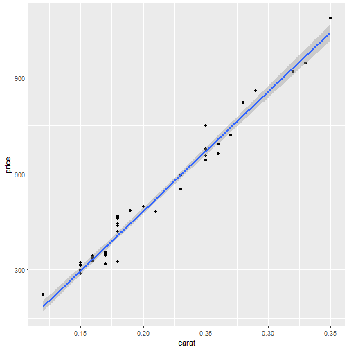

Predicting diamond prices
========================================================
author: 
date: 01 September 2017
autosize: true
transition: rotate

Wonder how much your diamond would cost?
========================================================
Use this app to predict the price of a diamond based on its weight! 

What is the prediction model based on? 
========================================================
The dataset used for this prediction is plotted below.

What is the regression model used? 
========================================================
By fitting the data to a linear regression model, we can predict the price of a diamond based on its weight.

Thank you for your attention
========================================================
type:prompt
Enjoy predicting the prices of diamonds (and buying them)!  
